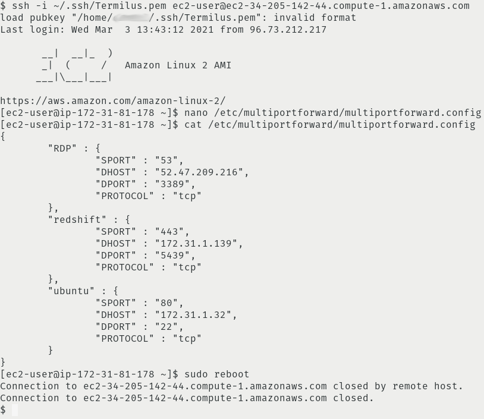

### **What**

Port forwarding or port address translation (PAT) is a method of changing the destination port of network traffic by using a forward proxy.

Network address translation (NAT) is the process of redirecting inbound network traffic destined for an exposed public IP address, to internal private non-routable IP addresses. The process is then reversed when the internal IPs communicate with external IPs.

### **Why**

The Multi-Port Forward Server serves both purposes of NAT-ing at PAT-ing when multiple streams of traffic need to be redirected. This is especially useful in the following scenarios:

1. Numerous internal servers listen on the same port, but must all be internet-exposed on a single IP address
2. Only one IP address can be whitelisted but multiple external hosts need to be accessed
3. Access to internal systems is needed externally, and traffic must traverse on port 443 or 80 to bypass a network firewall dropping all other ports

### **How**

For this tutorial we will deploy a single Multi-Port Forward Server that redirects inbound traffic to multiple hosts internally and externally.

Let’s assume the following network architecture:

* A VPC or subscription configured with a 172.31.0.0/16 CIDR range
* Two subnets configured:

  * One private, with no internet access (172.31.1.0/24)
  * One public, with an internet gateway configured for internet access (172.31.0.0/24)

  
* A Redshift cluster deployed to the private subnet which will be listening on its default TCP port, 5439
* An Ubuntu server deployed to the private subnet listening for inbound SSH connections on TCP port 22
* A Port Forward Server appliance deployed to the public subnet will be listening on TCP ports 443, 80, 53, and 22

  * Inbound TCP traffic on port 443 will be proxied to the Redshift server in the private subnet, destined for port 5439
  * Inbound TCP traffic on port 80 will be proxied to the Ubuntu server in the private subnet, destined for port 22
  * Inbound TCP traffic on port 53 will be proxied to portquiz.net, an external host listening on port 3389

  
* The VPC security group or subscription NSG needs to be configured to allow:

  * Inbound ports 443, 80, 53, and 22 from an authorized IP address
  * Inbound ports 5439 and 22 from the public subnet into the private subnet

    

Here is an architectural diagram of the setup we’ve just constructed:

Now that the infrastructure is setup, we're ready to deploy the Multi-Port Forward Server into the public subnet.

### How to deploy the Multi-Port Forward Server:

1. Deploy the AWS [Multi-Port Forward Server](https://aws.amazon.com/marketplace/pp/B086QWQQXX/?ref=_ptnr_termilus_ampfsc) or [Multi-Port Forward Server for Azure](https://azuremarketplace.microsoft.com/en-us/marketplace/apps/fatalsecurity1604924013537.multi-port-forward-server?tab=Overview) appliance from the marketplace into your public subnet
2. If in AWS, disable source and destination checks on the instance, [more info here](https://docs.aws.amazon.com/vpc/latest/userguide/VPC_NAT_Instance.html#EIP_Disable_SrcDestCheck)
3. SSH into the Multi-Port Forward Server
4. Open the /etc/multiportforward/​multiportforward.config file with vim or nano and update the SPORT, DHOST, DPORT and PROTOCOL entries (source port, destination host, destination port and connection protocol respectively) in JSON format; key names should be descriptive
5. Save the multiportforward.config file
6. Reboot the server

And that’s it! Your Multi-Port Forward Server should now be forwarding:

* All incoming port 443 TCP traffic is being directed to your Redshift cluster, deployed in your private subnet, listening on port 5439
* All incoming port 80 TCP traffic is being directed to your Ubuntu SSH server, deployed in your private subnet, listening on port 22
* All incoming port 53 TCP traffic is being directed to an external RDP server, listening on port 3389

You can test the connection to your Redshift cluster by entering the public DNS of your Multi-Port Forward Server as the target host using psql:

`psql -h ec2-12-34-56-78.compute-1.amazonaws.com -U awsuser -d dev -p 443`

Again, the same host name can be used to verify the connection to your internal Ubuntu SSH host:

`ssh -i ~/.ssh/Ubuntu.pem ubuntu@ec2-12-23-34-78.compute-1.amazonaws.com -p 80`

And similarly, use the same hostname when connecting via remote desktop.