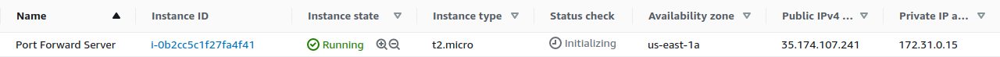
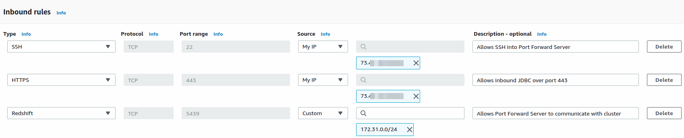
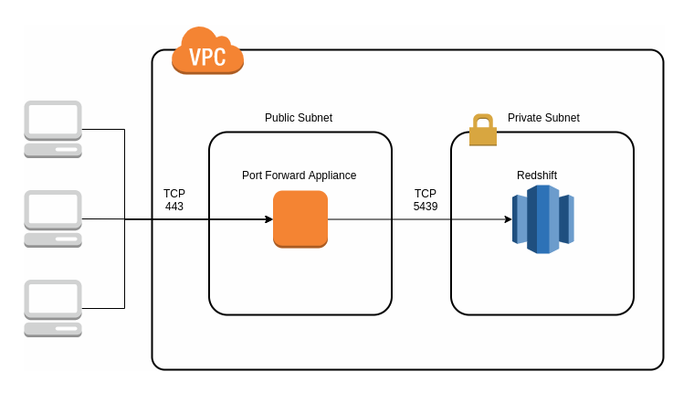
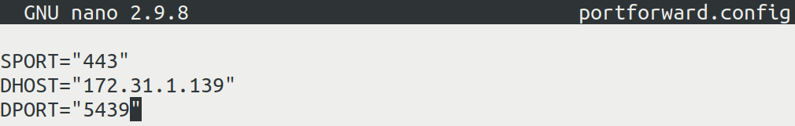
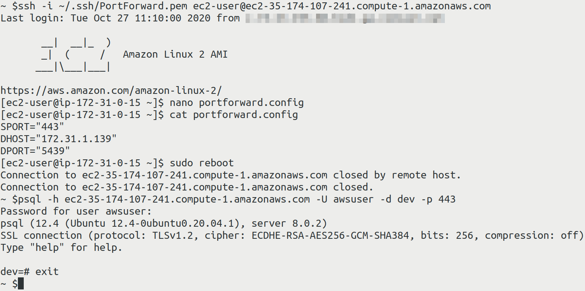

### **What**

Port forwarding or port address translation (PAT) is a method of altering the destination port of traffic by using a forward proxy.

### **Why**

There are multiple possible reasons to use a PAT server for port forwarding. Here are just a few:

1. Running multiple NAT’d servers with identical services competing for one port.
2. Changing the default destination port to a more common port to bypass layer 4 firewall restrictions.
3. Configuring round robin DNS where multiple AWS port forward servers can redirect traffic to one application server.

### **How**

For this tutorial we will use Redshift deployed to a private subnet in AWS as our example.

In this scenario, we are on-prem, and outbound traffic to port 5439 is blocked by the network firewall.

To get around this restriction, we will configure our Port Forward Server to publicly listen on port 443, and forward the incoming traffic to Redshift on port 5439. All incoming traffic will be IP whitelisted to only allowing traffic from our local IP address.

Let’s assume the following network architecture:

* A VPC configured with a 172.31.0.0/16 CIDR range.
* Two subnets configured:
* One private, with no internet access (172.31.1.0/24)
* One public, with an internet gateway configured for internet access (172.31.0.0/24)

  
* A Redshift cluster deployed to the private subnet which will be listening on its default port, 5439.
* A Port Forward Server appliance deployed to the public subnet will be listening on port 443. Incoming traffic will be proxied to the Redshift server in the private subnet, destined for port 5439.

  
* The VPC security group needs to be configured to allow:

  * Inbound ports 22 and 443 from an authorized IP address
  * Inbound port 5439 from the public subnet into the private subnet
  * And inbound traffic from the security group itself allowing internal VPC traffic

    

Here is an architectural diagram of the setup we’ve just constructed:

Once the networking is configured properly, we can deploy and configure the Port Forward Server appliance.

### Steps to deploy the Port Forward Server are as follows:

1. Deploy the AWS [Port Forward Server](https://aws.amazon.com/marketplace/pp/B07TDD4LM6/ref=_ptnr_termilus_apfsc) appliance from the marketplace into your public subnet
2. SSH into the Port Forward Server
3. Open the portforward.config file and update the SPORT, DHOST and DPORT entries (source port, destination host, and destination port respectively) to forward incoming traffic on port 443 to the Redshift cluster's private IP address, on Redshift's native port

   
4. Save the portforward.config file
5. Reboot the server

And that’s it! Your Port Forward Server should now be forwarding all incoming port 443 traffic to your Redshift cluster, deployed in your private subnet, listening on port 5439.

You can test this by connecting to your Redshift cluster by entering the public DNS of your Port Forward Server as the target host using psql:

`psql -h ec2-12-34-56-78.compute-1.amazonaws.com -U awsuser -d dev -p 443`