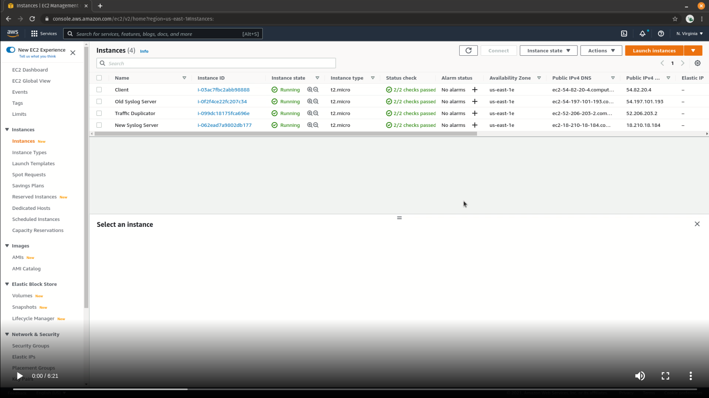

# What is UDP traffic duplication?

UDP traffic is stateless, meaning clients send messages to a destination host, however those messages are not tracked to ensure delivery.

Traffic duplication simply implies replicating a source stream of traffic so that is can be forwarded to multiple destination hosts.

# Why is UDP traffic duplication necessary?

Sometimes when new destination host is provisioned, client traffic may need to be replicated so that both the old and the new destination hosts will receive identical traffic. Rather than having the client resend identical messages to two different hosts, a UDP duplication appliance can be used to clone the traffic streams in real-time.

# How can I duplicate UDP traffic in AWS?

1. Deploy the [Traffic Duplicator appliance in the AWS Marketplace](https://aws.amazon.com/marketplace/pp/prodview-5xxv5k33yxe6k).
2. Disable source and destination checks on the Traffic Duplicator instance.
3. SSH into the Traffic Duplicator appliance and edit its config file using nano:\
   `nano /etc/trafficduplicator/trafficduplicator.config`
4. Update the JSON file to reflect your desired forwarding rules. In this example, I'm duplicating inbound syslog streams to be sent to multiple rsyslog servers. Only the entry name, SOURCEPORT value and DESTINATION values are updated:\
   `{
           "DuplicateSyslog" : {
                   "SOURCEPORT" : "514",
                   "DESTINATION" : ["172.31.63.131/514", "172.31.62.154/514"]
           }
   }`
5. Save the file and reboot the appliance.
6. Update client-side configurations to send UDP traffic (syslog in this case) to the Traffic Duplicator appliance.
7. Validate receipt of traffic server-side on all defined destinations.

## Video

