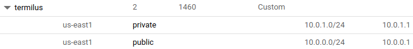
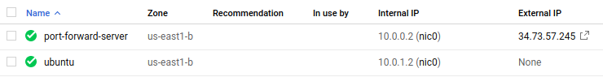
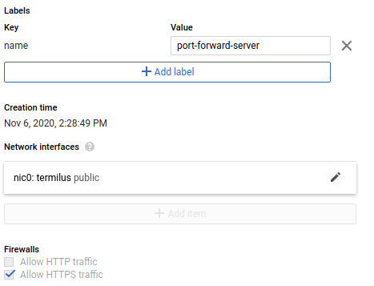
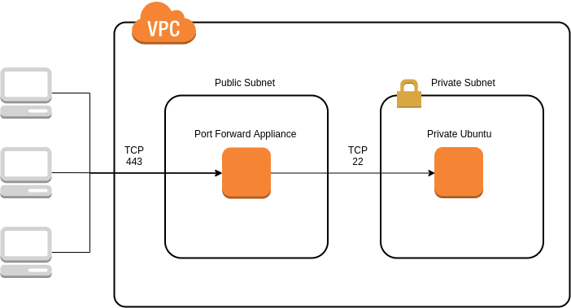
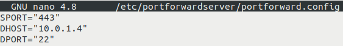
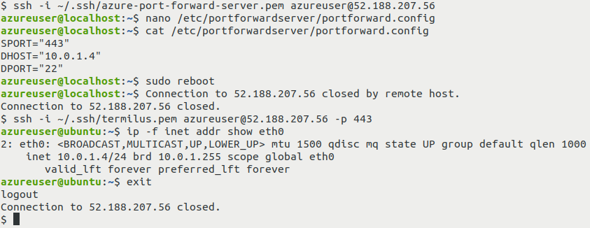

### **What**

Port forwarding or port address translation (PAT) is a method of altering the destination port of traffic by using a forward proxy.

### **Why**

There are multiple possible reasons to use a PAT server for port forwarding. Here are just a few:

1. Running multiple NAT’d servers with identical services competing for one port.
2. Changing the default destination port to a more common port to bypass layer 4 firewall restrictions.
3. Configuring round robin DNS where multiple Azure port forward servers can redirect traffic to one application server.

### **How**

For this tutorial we will use an Ubuntu server deployed to a private subnet in GCP as our example.

In this scenario, we are on-prem, and outbound traffic to port 22 is blocked by the network firewall.

To get around this restriction, we will configure our Port Forward Server to publicly listen on port 443, and forward the incoming traffic to our private Ubuntu server listening on port 22. All incoming traffic will be IP whitelisted to only allowing traffic from our local IP address.

Let’s assume the following network architecture:

* A virtual network (vnet) configured with a 10.0.0.0/16 CIDR range.
* Two subnets configured:

  * One private, with no internet access (10.0.1.0/24)
  * One public, with an internet gateway configured for internet access (10.0.0.0/24)

  
* An Ubuntu server deployed to the private subnet which will be listening for SSH connections on its default port, 22.
* A Port Forward Server appliance deployed to the public subnet will be listening on port 443. Incoming traffic will be proxied to the Ubuntu server in the private subnet, destined for port 22.

  
* The Port Forward Server network security group needs to be configured to allow:

  * Inbound ports 22 and 443 from an authorized IP address

  
* The Ubuntu server network security group needs to be configured to allow:

  * Only inbound port 22 from a the Port Forward Server IP address

Here is an architectural diagram of the setup we’ve just constructed:

Once the networking is configured properly, we can deploy and configure the Port Forward Server appliance.

### Steps to deploy the Port Forward Server are as follows:

1. Deploy the Azure Port Forward Server virtual machine from the marketplace into your public subnet
2. SSH into the Port Forward Server
3. Open the /etc/portforwardserver/portforward.config file and update the SPORT, DHOST and DPORT entries (source port, destination host, and destination port respectively) to forward incoming traffic on port 443 to the Ubuntu server's private IP address, on port 22

   `nano /etc/portforwardserver/portforward.config`

   
4. Save the portforward.config file
5. Reboot the server

And that’s it! Your Port Forward Server should now be forwarding all incoming port 443 traffic to your Ubuntu server, deployed in your private subnet, listening on port 22.