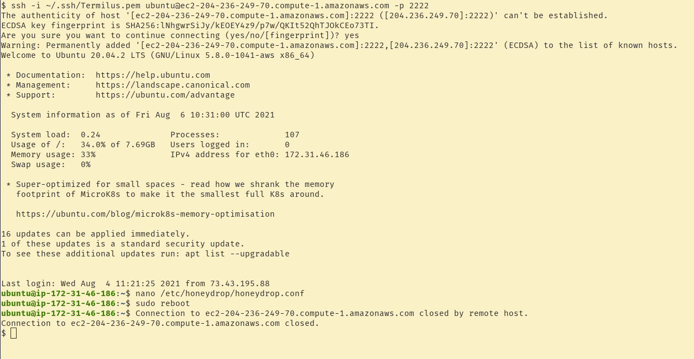

## What

The HoneyDrop appliance is a low-interaction honeypot meant to be deployed in subnets where critical visibility of malicious activities is needed. The HoneyDrop can be configured to emulate:

* Windows SQL servers
* Windows web servers
* Linux MySQL servers
* Linux web servers

When the HoneyDrop appliance is interacted with, logs are generated and sent to AWS CloudWatch within seconds for alerting. These alerts can trigger SNS notifications to send emails, SMS messages or launch Lambda functions.

## Why

* Gain visibility into your AWS VPS network environments.
* Enhance security posture without needing to install agents on instances.
* Lure attackers away from high value systems long enough to be identified.
* Enable automated incident response actions to isolate and quarantine compromised hosts.

## How

The following steps will explain how to setup and deploy the HoneyDrop appliance.

1. Deploy the [HoneyDrop appliance](https://aws.amazon.com/marketplace/pp/prodview-fvbdhof5t5qa6) from the AWS marketplace into your target subnet. Note that once the appliance is deployed, the administrative SSH service takes a minute to become active.
2. Navigate to https://console.aws.amazon.com/iamv2/home#/roles and click on "Create role".
3. Set the trusted entity type to "AWS service" and the use case to "EC2", now click next.
4. Attach the "CloudWatchAgentServerPolicy" and click next.
5. Optionally add your keys and click next.
6. Name the role "HoneyDropRole" and click "Create role".
7. Navigate back to EC2, https://console.aws.amazon.com/ec2/v2/home#Instances:instanceState=running
8. Right-click on the HoneyDrop appliance, under "Security" click "Modify IAM role"
9. Select the HoneyDropRole and click "Save".
10. Now, SSH into the HoneyDrop appliance: `ssh -i <private key> ubuntu@<IP address> -p 2222`
11. Update the honeydrop.config file: `nano /etc/honeydrop/honeydrop.conf`

    * To emulate a Windows SQL server, change the following services to true:

      * smb.enabled
      * mssql.enabled
    * To emulate a Windows web server, change the following services to true:

      * smb.enabled
      * http.enabled
      * httpproxy.enabled
    * To emulate a Linux MySQL server, change the following services to true:

      * mysql.enabled
      * ssh.enabled
      * vnc.enabled
    * To emulate a Linux web server, change the following services to true:

      * ftp.enabled
      * http.enabled
      * ssh.enabled
      * vnc.enabled
      * telnet.enabled
12. Finish editing the HoneyDrop configuration file, save it and reboot the appliance.
13. Edit the security group of the HoneyDrop appliance to only allow honeypot ports to be exposed: https://console.aws.amazon.com/ec2/v2/home#SecurityGroups:

In the example below, we've setup a Linux MySQL honeypot and are allowing connections to MySQL, SSH and VNC:

And that's it! Your appliance should now be up and running in your environment. Test the services you enabled by interacting with them and see the alerts appear in AWS CloudWatch.

## Video

### Setting Up Alarms

Now that your HoneyDrop appliance is set up and configured, it's time to configure some alerts.

First, let's configure the metric filter within CloudWatch Logs. This is necessary to identify events triggered by the HoneyDrop appliance. AWS does a great job explaining the setup [here](https://docs.aws.amazon.com/AmazonCloudWatch/latest/logs/CreateMetricFilterProcedure.html), but for the sake of simplicity, navigate [here](https://console.aws.amazon.com/cloudwatch/home#logsV2:log-groups/log-group/honeydrop.log$23metric-filters) and click on "Create Metric Filter".

Here we will set the filter pattern to "src_host". This means that any time an event is recorded, the metric filter will be triggered since all HoneyDrop events capture the source host field in their logs. Set the additional parameters according to the image below.

Next, we need to setup our SNS topic. This is the mechanism that will send an email out whenever the HoneyDrop catches an attacker. We'll start by navigating to AWS Simple Notification Service (SNS) and clicking on "Topics", or just click [here](https://console.aws.amazon.com/sns/v3/home#/topics). Now, click on "Create topic". Enter the  details according to the following image.

Now we need to subscribe to our topic by clicking on "Create subscription". Set the "Protocol" to email and the "Endpoint" to your email address then click "Create subscription". 

*Don't forget to check your email and click "Confirm subscription".*

Next, we'll configure a CloudWatch alarm. Navigate to the the "All alarms" pane in CloudWatch, [here](https://console.aws.amazon.com/cloudwatch/home#alarmsV2:) and click "Create alarm" and then "Select metric". Here, we'll select "HoneyDropMetrics", then "Metrics with no dimensions", then check "HoneyDropEvent" and click "Select metric". Now, enter the metric and condition details according to the following images and click "Next".

Now, we'll configure the alarm to send our SNS notification whenever it's triggered. Once our SNS topic is selected, we can hit "Next".

Here, we enter our alarm name and description and hit "next".

Finally, we can review our alarm and hit "Create alarm".

That's it. Now, whenever our HoneyDrop appliance lures in an attacker, its services will capture the interaction and trigger an SNS email notification - alerting you that bad things are happening.