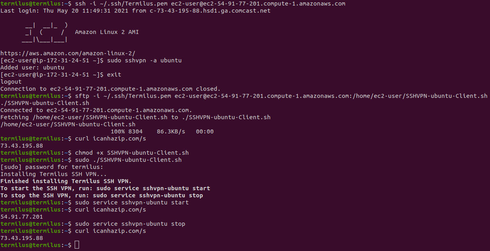

## Estimated Deployment Time

10 Minutes

## What

The Termilus SSH VPN server is a remote access solution similar to a traditional VPN, however traffic traverses an SSH tunnel as opposed to PPTP, L2TP, IPSEC etc.

Currently, the Termilus SSH VPN has been tested and confirmed to be working with the following clients:

* Ubuntu 20.04
* CentOS Stream 8
* Fedora 34
* MacOS Big Sur

## Why

* The Termilus SSH VPN provides remote access to your AWS VPC or Azure subscription. This means once you've connected you'll be able to access internal systems to your subscription or VPC on private subnets.
* It provides a secure, encrypted tunnel to your subscription or VPC providing protection from unscrupulous internet service providers or Wi-Fi hotspots.
* It masks your actual origin IP address. Meaning, any sites you visit or systems you connect to will see the Termilus SSH VPN's public IP address as the connection's origin.

## How

The following steps will explain how to create and deploy the Termilus SSH VPN clients. If you'd rather watch the video explainer, please scroll to the bottom.

1. Deploy the Termilus SSH VPN into your Azure subscription or [into AWS](https://aws.amazon.com/marketplace/pp/B095WLYM3B). The server will need to be assigned a publicly accessible IP address. If you're following along, make sure to update all subsequent commands with the public IP address or DNS record for your server. In this example, mine will be: `ec2-54-91-77-201.compute-1.amazonaws.com`
2. Connect to the Termilus SSH VPN: `ssh -i ~/.ssh/Termilus.pem ec2-user@ec2-54-91-77-201.compute-1.amazonaws.com`
3. Run the sshvpn command to create a new SSH VPN user. For this example, our client will be an Ubuntu machine, so we will call this client "ubuntu": `sudo sshvpn -a ubuntu`
4. Exit the SSH session with the server: `exit`
5. Use SFTP to retrieve the client installer script: `sftp -i ~/.ssh/Termilus.pem ec2-user@ec2-54-91-77-201.compute-1.amazonaws.com:/home/ec2-user/SSHVPN-ubuntu-Client.sh ./SSHVPN-ubuntu-Client.sh`

   Or, copy and paste the client installer script to the destination host using ssh and cat: `ssh -i ~/.ssh/Termilus.pem ec2-user@ec2-54-91-77-201.compute-1.amazonaws.com -t "cat /home/ec2-user/SSHVPN-ubuntu-Client.sh"`

   Now, paste the file contents into a new file on the client machine and save the file as: `SSHVPN-ubuntu-Client.sh`
6. Make the client installer script executable: `chmod +x SSHVPN-ubuntu-Client.sh`
7. Run the installer script: `sudo ./SSHVPN-ubuntu-Client.sh`
8. And that's it! The SSH VPN can now be toggled on with:

   Linux: `sudo service sshvpn-ubuntu start`

   MacOS: `sudo launchctl load /Library/LaunchDaemons/org.termilus.sshvpn.plist`

   To toggle off the SSH VPN, run:

   Linux: `sudo service sshvpn-ubuntu stop`

   MacOS: `sudo launchctl unload /Library/LaunchDaemons/org.termilus.sshvpn.plist`

Here is a quick diagram of what we just deployed:

### **Video Walk-Through**

## Troubleshooting

* Unable to connect to the SSH VPN?

  * Check to make sure appliance's security group allows inbound SSH connections from the correct source IP address(es).
  * Make sure the client has been created, that the install script has been ran, and that the SSH VPN service has been started.
  * Ensure the SSH VPN server is powered on.
  * Make sure the client network firewall is not preventing outbound SSH communication to the appliance.

## FAQ

* Does the SSH VPN appliance support single-AZ, multi-AZ or multi-region deployments? The appliance is a single EC2 instance that can be deployed into any VPC in any region.
* Does the SSH VPN appliance support all regions? Yes, all regions are supported.
* Should we use the root user for deploying the SSH VPN appliance? No, it is recommended to use a non-root user to deploy the appliance.
* Should the SSH VPN appliance be encrypted when deployed? Yes, security best-practice is to encrypt the appliance when provisioned.
* Is data in-transit encrypted? Yes, all communication through the SSH VPN server is encrypted via the SSH encryption cipher suites.
* Which services used by SSH VPN are billable? The SSH VPN appliance incurs EC2, and software cost when deployed. For example, a t3.medium SSH VPN instance costs $0.042 per hour plus $0.05 per hour for software for a total of $0.092 per hour of deployment.
* How can I monitor the health of the SSH VPN appliance? Check the health of your server by viewing its status in the "Instance State" column in the EC2 Dashboard.
* How does the SSH VPN appliance get patched and updated? The appliance is set to auto-install security patches on a daily basis.
* How do I handle a non-responsive SSH VPN appliance? This is very rare, but a reboot should resolve the issue.
* Is there technical assistance available to help troubleshoot? Yes, we're available to assist and will typically respond within 1 business day. We can be reached by emailing: support at termilus.com