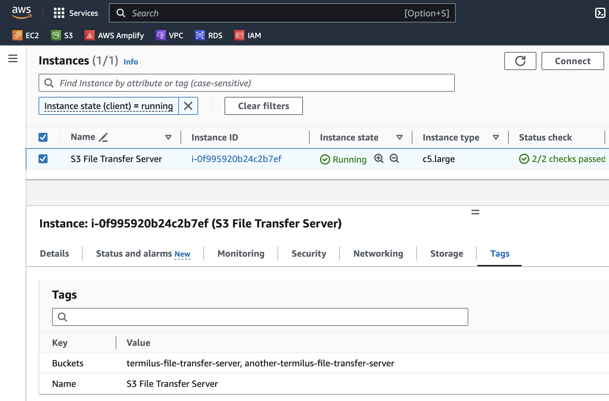
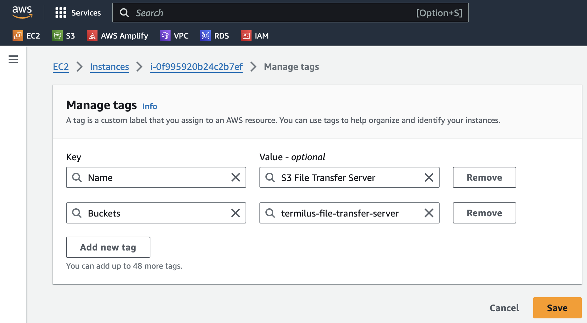
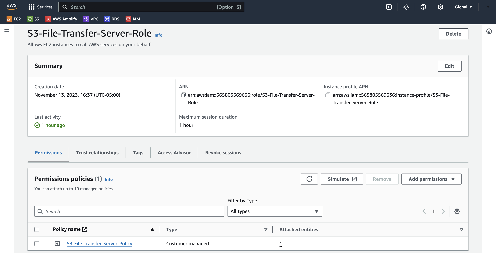
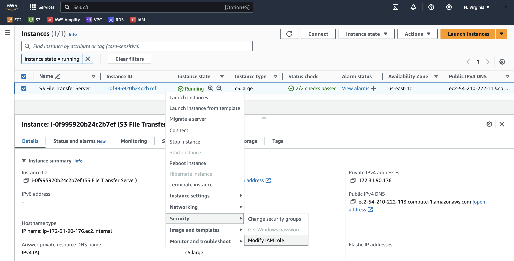
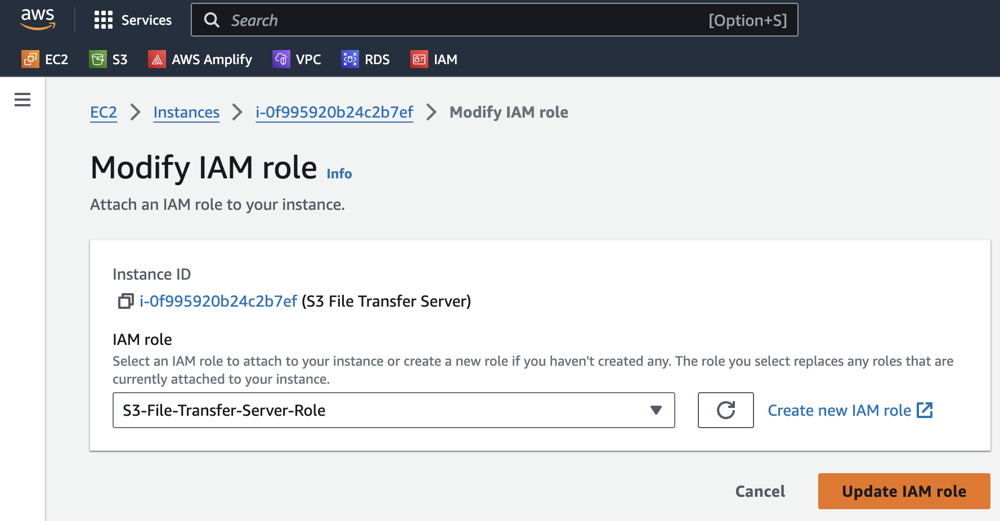
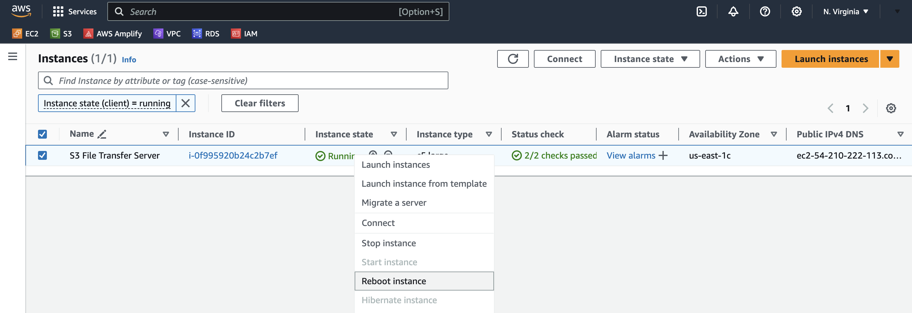
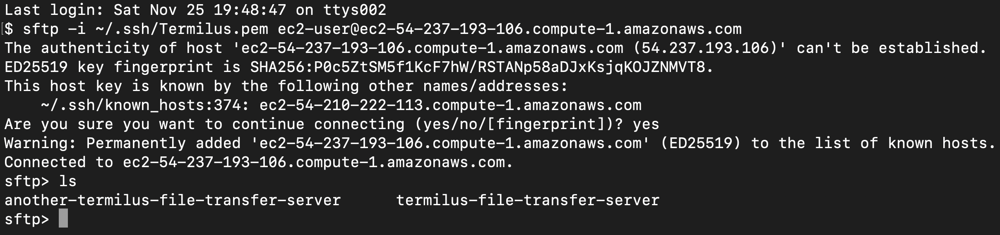

## Estimated Deployment Time

10 Minutes

## What

The S3 File Transfer Server is a fast, secure, and super simple appliance to make getting files into and out of S3 a breeze. Deploying the S3 File Transfer Server, allows you to expose SFTP to your clients or other internal and external services. Files are uploaded and downloaded in real-time and never persist on the appliance itself. 

The server can be encrypted at deployment and all communication can be over SSH and SFTP, meaning all traffic is encrypted at all times. FTP is supported but not recommended for production deployments.

The S3 File Transfer Server was designed to be deployed quickly and easily. Configuration is straight forward and maintenance is automated.

## Why

* The S3 File Transfer Server is a convenient, familiar file transfer capabilities with S3 scalability and durability.
* The appliance is a turn-key solution, ready for production deployments.
* Encryption and speed are baked into the appliance to protect sensitive data while enabling speedy file transfers.

## How

Deploying, setting up and configuring the S3 File Transfer Server is super quick and easy. Just follow these steps.

1. To begin, you will first need to deploy the [S3 File Transfer Server](https://aws.amazon.com/marketplace/pp/prodview-shh2f5imxqqm6) from the AWS Marketplace.
2. Next, configure tags on the EC2 instance. The tag name should be "Buckets" and the value should be one or more S3 bucket names that will be used for file transfers.

   

   
3. Next, in IAM, create a new policy called `S3-File-Transfer-Server-Policy`. In this policy, paste the following JSON:

```
{
    "Version": "2012-10-17",
    "Statement": [
        {
            "Sid": "Stmt1473154086000",
            "Effect": "Allow",
            "Action": [
                "ec2:DescribeTags"
            ],
            "Resource": [
                "*"
            ]
        },
        {
            "Effect": "Allow",
            "Action": [
                "s3:ListBucket"
            ],
            "Resource": "arn:aws:s3:::*"
        },
        {
            "Effect": "Allow",
            "Action": [
                "s3:AbortMultipartUpload",
                "s3:DeleteObject",
                "s3:GetObject",
                "s3:PutObject"
            ],
            "Resource": "arn:aws:s3:::*/*"
        }
    ]
}
```

4. Now, create an IAM role called `S3-FileTransfer-Server-Role` and attach the `S3-File-Transfer-Server-Policy` that we just created.

   
5. Next, modify the role of the EC2 instance so it has the S3-File-Transfer-Server-Role attached to it.

   

   
6. Finally, now that the role has been created and attached to the EC2 instance, we just need to reboot the appliance.

   

7. And that's it! Now, you can now SFTP into the server:

   

## Troubleshooting

* Unable to access the SFTP service?

  * Double check the security group associated with the S3 File Transfer Server to ensure inbound traffic is permitted on port 22 from the appropriate source IP address.
* Not seeing files on the S3 File Transfer Server that exist in the bucket?

  * Make sure that the security policy is attached to the role and that the S3 File Transfer Server has the role attached to itself.


## FAQ

* Does the S3 File Transfer Server appliance support single-AZ, multi-AZ or multi-region deployments? The appliance is a single EC2 instance that can be deployed into any VPC in any region.
* Does the S3 File Transfer Server appliance support all regions? Yes, all regions are supported.
* Should we use the root user for deploying the S3 File Transfer Server appliance? No, it is recommended to use a non-root user to deploy the appliance.
* Should the S3 File Transfer Server appliance be encrypted when deployed? Yes, security best-practice is to encrypt the appliance when provisioned.
* Is data in-transit encrypted? Yes, communication via SSH and SFTP is encrypted in-transit.
* Which services used by S3 File Transfer Server are billable? The S3 File Transfer Server appliance incurs S3, EC2, and software cost when deployed. For example, a t3.medium S3 File Transfer Server instance costs $0.042 per hour plus $0.088 per hour for software for a total of $0.13 per hour of deployment.
* How can I monitor the health of the S3 File Transfer Server appliance? Check the health of your server by viewing its status in the "Instance State" column in the EC2 Dashboard.
* How does the S3 File Transfer Server appliance get patched and updated? The appliance is set to auto-install security patches on a daily basis.
* How do I handle a non-responsive S3 File Transfer Server appliance? This is very rare, but a reboot should resolve the issue.
* Is there technical assistance available to help troubleshoot? Yes, we're available to assist and will typically respond within 1 business day. We can be reached by emailing: support at termilus.com