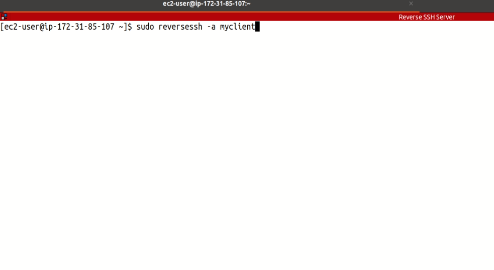

### **What**

The Reverse SSH Server is an appliance which provides persistent connections to other servers or IoT devices even when those endpoints are deployed in private IP environments and even if the endpoints reboot unexpectedly.

This persistent connection is provided by SSH over port 22 by default. Authentication to the server is specific to each client and key-based authentication is used. Old clients can be removed from the server and new clients can be added at anytime.

### **Why**

The Reverse SSH Server eliminates the need to track and remember multiple, dozens, or hundreds of IP addresses of endpoint systems which need to be managed. All clients auto-connect to the server and maintain the reverse connection at all times. The reverse SSH server meets the following needs:

1. Persistent client connections to single server for easier administration.
2. Custom client names for ease of administration.
3. Connection durability - auto reconnects even across reboots.
4. Ability to change server listening port on initial setup from 22 to 443 or any other port.

### **How**

To begin the Reverse SSH Server deployment, navigate to the AWS marketplace here and deploy the appliance.

Configure the security group to only allow inbound SSH.

SSH into the Reverse SSH Server and create your first client script by running:

`sudo reversessh -a myclient`

The "-a" flag indicates that we're adding a user, and the program will output the client script into your current directory.

Display the file contents to the screen and copy its content to your clipboard (remember to replace "myclient" with your actual client name):

`cat ReverseSSH-myclient-Client.sh`

Now, in a separate window, SSH into your client machine and create the same client script:

`nano ReverseSSH-myclient-Client.sh`

Paste the clipboard content into this script, save, and close the file.

Make the client script executable:

`chmod +x ReverseSSH-myclient-Client.sh`

Run the client script with sudo privileges:

`sudo ./ReverseSSH-myclient-Client.sh`

Now, back in the Reverse SSH Server window, validate that the client has successfully connected:

`sudo netstat -antp`

If the client successfully connected, its name will be shown on the far right, and its SSH port will be forwarded to be locally accessible to the Reverse SSH Server.

We can now connect to the client machine locally via the Reverse SSH Server by specifying the client's username, forwarded SSH port and the client's RSA key. In our example, the client's username was ec2-user and the port which was forwarded was 56148:

`ssh ec2-user@127.0.0.1 -p 56148 -i ~/.ssh/myclient-id_rsa`

That's it, you can add as many clients as you wish to the Reverse SSH Server.

### **Removing a client from the Reverse SSH Server**

On the Reverse SSH Server, we can remove a client by running:

`sudo reversessh -r myclient`

The "-r" flag indicates that we are removing a client. This operation will remove a client from the Reverse SSH Server and terminate any existing connections from that client.

### **Video Walk-Through**

